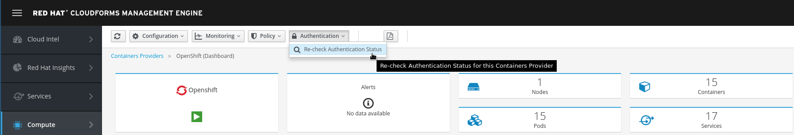
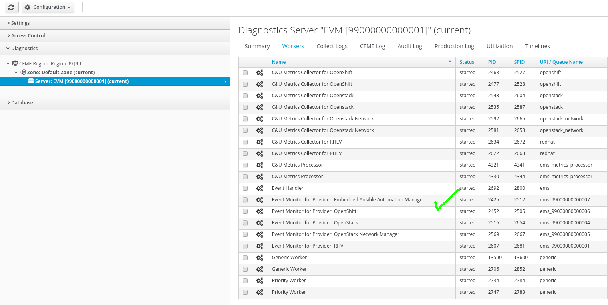
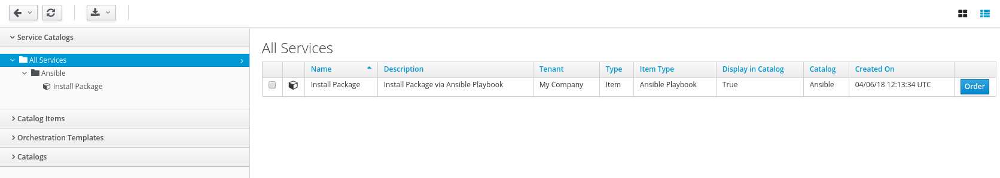
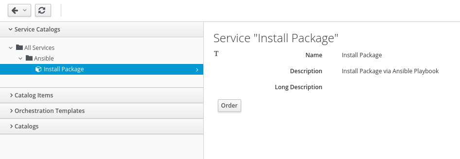
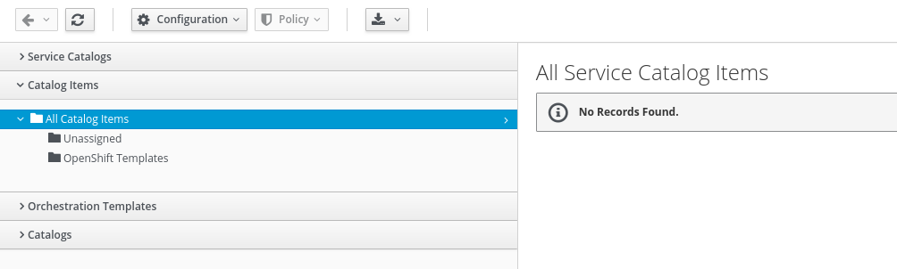
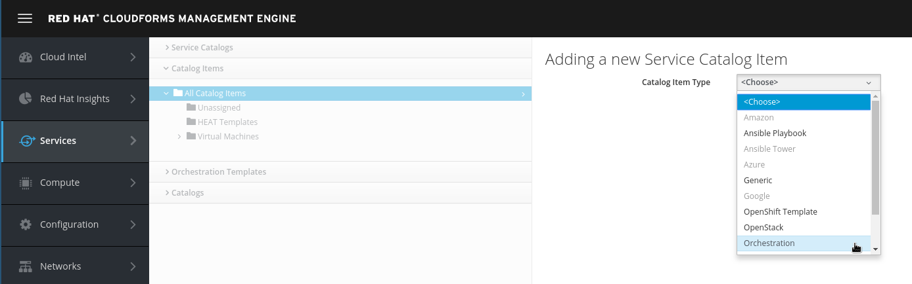

# Lab Introduction

<!-- TOC -->

- [Lab Introduction](#lab-introduction)
    - [Introduction to CloudForms](#introduction-to-cloudforms)
        - [Access the lab environment](#access-the-lab-environment)
    - [Verify Lab](#verify-lab)
        - [OpenStack Provider status](#openstack-provider-status)
        - [Red Hat Virtualization Provider status](#red-hat-virtualization-provider-status)
        - [Red Hat OpenShift Container Platform status](#red-hat-openshift-container-platform-status)
    - [Build a Service Catalog with CloudForms](#build-a-service-catalog-with-cloudforms)
        - [Value provided by a Service Catalog](#value-provided-by-a-service-catalog)
        - [Service Basics](#service-basics)
        - [Virtual Machine Provisioning example](#virtual-machine-provisioning-example)
        - [Build a VM Provisioning Service Dialog](#build-a-vm-provisioning-service-dialog)
        - [Build a VM Provisioning Service Catalog](#build-a-vm-provisioning-service-catalog)
        - [Build a Virtual Machine Service Catalog Item](#build-a-virtual-machine-service-catalog-item)
        - [Order the Simple Virtual Machine Service Catalog Item](#order-the-simple-virtual-machine-service-catalog-item)
        - [Verify the order](#verify-the-order)
    - [Ansible Example](#ansible-example)
        - [Introduction to Ansible](#introduction-to-ansible)
        - [Make sure embedded Ansible role is enabled and running](#make-sure-embedded-ansible-role-is-enabled-and-running)
        - [Add a Git repository of Ansible Playbooks](#add-a-git-repository-of-ansible-playbooks)
        - [Store Virtual Machine Credentials](#store-virtual-machine-credentials)
        - [Create an Ansible Service Catalog](#create-an-ansible-service-catalog)
        - [Create a Service Catalog Item](#create-a-service-catalog-item)
        - [Test the Service Catalog Item](#test-the-service-catalog-item)
    - [OpenShift example](#openshift-example)
        - [Create Service Dialog from an OpenShift Template](#create-service-dialog-from-an-openshift-template)
        - [Create an OpenShift Service Catalog](#create-an-openshift-service-catalog)
        - [Create a OpenShift Template Service Catalog Item](#create-a-openshift-template-service-catalog-item)
        - [Order the OpenShift Template](#order-the-openshift-template)
        - [Verify provisioning of OpenShift application](#verify-provisioning-of-openshift-application)
    - [OpenStack HEAT](#openstack-heat)
        - [HEAT Provisioning example](#heat-provisioning-example)
        - [Prepare the HEAT Template](#prepare-the-heat-template)
        - [Import the HEAT Template](#import-the-heat-template)
        - [Create a Service Dialog from a HEAT template](#create-a-service-dialog-from-a-heat-template)
        - [Verify the Service Dialog](#verify-the-service-dialog)
        - [Build a HEAT Service Catalog](#build-a-heat-service-catalog)
        - [Build a HEAT Service Catalog Item](#build-a-heat-service-catalog-item)
        - [Order the HEAT Wordpress Catalog Item](#order-the-heat-wordpress-catalog-item)
    - [Advanced labs](#advanced-labs)
        - [Use the Self Service user Interface](#use-the-self-service-user-interface)
        - [Use role Based Access Control to publish Service Catalog](#use-role-based-access-control-to-publish-service-catalog)
            - [User Groups](#user-groups)
            - [Roles](#roles)
            - [More details](#more-details)
            - [Create a Role](#create-a-role)
            - [Create a new Group](#create-a-new-group)
            - [Create a new User](#create-a-new-user)
            - [Test user Joe Doe](#test-user-joe-doe)
            - [Grant access to certain Catalog Items](#grant-access-to-certain-catalog-items)
            - [Test once more as Joe Doe](#test-once-more-as-joe-doe)
        - [Even more?](#even-more)

<!-- /TOC -->

## Introduction to CloudForms

[Red Hat CloudForms](http://www.redhat.com/cloudforms) is an infrastructure management platform that offers a consistent way to track costs, control resource allocation, and ensure compliance across all your networked environments. Manage Virtual Machines, containers, and your clouds in the same way with a single tool.

In this lab we will focus on the Self Service Catalog features CloudForms provides. We will learn how to create Service Catalogs, add individual Items and see how end users can browse and order from the Service Catalog.

For more details about CloudForms, you can have a look at the [General introduction](../../common/index.md).

### Access the lab environment

Your workstation was configured to show a start page which has instructions on how to access the lab and this guide. Make sure you use the GUID provided on the front page in all of the following examples.

To access the Red Hat CloudForms Management Engine use the URL and credentials below:

        URL: https://cf46-<GUID>.rhpds.opentlc.com

        User: admin

        Password: r3dh4t1!

The ID &lt;GUID&gt; is unique to your lab environment and was presented to you on the browser start page! Replace the &lt;GUID&gt; with your lab specific value. For example, if your &lt;GUID&gt; would be "123a" the URL would become:

        https://cf46-123a.rhpds.opentlc.com

***Note:*** Your browser might give you a warning message about the used SSL Certificates. These warning messages can be accepted and are due to the fact that each lab deployed with new certificates on request.

## Verify Lab

Let's start by verifying the status of all providers. Use the URL example and login credentials provided above to log into your appliance.

In CloudForms we can add so called "Providers". Providers are categorized into Cloud, Infrastructure, Physical and Container Providers. CloudForms 4.6 supports the following list of providers:

Cloud Providers:

- Amazon EC2
- Microsoft Azure
- Google Compute Platform

Infrastructure as a Service Providers:

- Red Hat Virtualization
- Red Hat OpenStack Platform
- VMware vSphere
- Microsoft System Center Virtual Machine Manager

Physical Providers:

- Lenovo XClarity

Container Providers:

- OpenShift Container Platform

Let's first verify the providers you have available and check their health status.

### OpenStack Provider status

[OpenStack](http://www.redhat.com/openstack) gives you a modular cloud infrastructure that runs off standard hardware—letting you deploy the tools you need, when you need them, all from one place.

Let's first check the OpenStack Provider:

1. Navigate to ***Compute*** -> ***Clouds*** -> ***Providers***

    

    ***Note:*** Don't click while navigating the menu structure, just hover until you reach the entry you want...

1. You should see a tile icon labeled "OpenStack". Click on it.

    

1. Click on ***Authentication*** -> ***Re-check Authentication Status***

    

    This will validate the credentials are correct, and it will also restart the provider specific background processes.

    Click the little arrow to reload the page.

    

After reloading the page, the provider tile should show a green check mark and the last refresh fields should report "less than a minute ago" or similar.

***Note:*** Don't worry if the last refresh does not change. As long as the provider icon is showing a green check box, you're good and can carry on with the lab.

### Red Hat Virtualization Provider status

Take complexity and application processing latency out of your implementation. Go beyond bare metal and virtualize more resource-intensive workloads on fewer servers. Requiring no modification with better synchronization, [Red Hat Virtualization](http://www.redhat.com/rhv) is a natural choice for virtualized Linux workloads.

Let's then check the RHV Provider:

1. Navigate to ***Compute*** -> ***Infrastructure*** -> ***Providers***

    

1. You should see a tile icon labeled "RHV". Click on it.

    

1. Click on ***Authentication*** -> ***Re-check Authentication Status***

    

    This will validate the credentials are correct, and it will also restart the provider specific background processes.

1. Switch to the ***Summary view*** by clicking the little icon on the top right

    

1. Click the little arrow to reload the page.

    

After reloading the page, the provider tile should show a green check mark and the last refresh fields should report "less than a minute ago" or similar.

***Note:*** Don't worry if the last refresh does not change. As long as the provider icon is showing a green check box, you're good and can carry on with the lab.

### Red Hat OpenShift Container Platform status

[Red Hat® OpenShift](http://www.redhat.com/openshift) is a container application platform that brings Docker and Kubernetes to the enterprise. Regardless of your applications architecture, OpenShift lets you easily and quickly build, develop, and deploy in nearly any infrastructure, public or private. Whether it’s on-premise, in a public cloud, or hosted, you have an award-winning platform to get your next big idea to market ahead of your competition.

Let's finally check the OpenShift Provider:

1. Navigate to ***Compute*** -> ***Containers*** -> ***Providers***

    

1. You should see a tile icon labeled "OpenShift". Click on it.

    

1. Click on ***Authentication*** -> ***Re-check Authentication Status***

    

    This will validate the credentials are correct, and it will also restart the provider specific background processes.

1. Click on the little icon ***Summary View*** in the top right

    

1. Check Summary View

    

    Click the little arrow to reload the page. 

    

After reloading the page, the provider tile should show a green check mark and the last refresh fields should report "less than a minute ago" or similar.

***Note:*** Don't worry if the last refresh does not change. As long as the provider icon is showing a green check box, you're good and can carry on with the lab.

***Note:*** Metrics collection has been disabled in this lab. If the "Last Metrics Collection" is not updated, this can be ignored.

## Build a Service Catalog with CloudForms

This lab will guide you through the process of creating a service catalog in CloudForms.

### Value provided by a Service Catalog

One of the features a Cloud Management Platform provides, is a self service user interface. Here users can order, manage and retire services. Services are categorized in catalogs, where they can be organized and easily consumed.

By providing a service catalog, users can deploy the services they need quickly and simply. This will improve agility, reduce provisioning time and free up resources in internal IT.

### Service Basics

But first some basics. Four items are required to make a service available to users from the CloudForms self service portal:

1. Provisioning Dialog

   The provisioning dialog specifies the list of customizable parameters. For example, when you want to order a Virtual Machine, users can specify the number of virtual CPUs, how much memory the VM should have and other parameters. The list of possible parameters is defined in the Provisioning Dialog

1. A Service Dialog

    When the user orders and Item from the Service Catalog, you might want to allow them to override certain default values. For example, you might allow users to choose from a range of values how much memory the new Virtual Machine should have. You might want them to choose between possible values like 2, 4, or 8 GB of RAM - but not more or less. This is specified in the Service Dialog.

1. A Service Catalog Item

    The Service Catalog Item is what users will see and be able to order. It usually consists of a Service Dialog allowing users to change specific parameters, it can have a nice icon and an (optional) HTML description. Service Catalog Items are organized in Service Catalogs for easier navigation.

1. A Service Catalog

    The Service Catalog allows administrator to organize the Catalog Items. You might want to have a Catalog for different Virtual Machine types, or one offering certain applications like Wordpress, MariaDB etc. Or you might want to categorize by Operating System. This is done by creating Service Catalogs and adding Items to them.

We can also use Role Based Access Control to make certain Service Catalog Items available to specific groups of users.

### Virtual Machine Provisioning example

The first example will guide you through the process of offering a Service Catalog Item to provision a simple Virtual Machine. This will include:

- Design a Service Dialog: a form which will ask the user for the necessary input data
- Create a Service Catalog: this allows administrators to organize Service Catalog Items to make it easy for end users to find what they need
- Publish a Service Catalog Item: this is the object end users can adjust to their needs and order from the Service Catalog

The previous chapter mentions a fourth object, the Provisioning Dialog. We do not have to create one, since there are good defaults shipped with the product.

The following chapters will guide you through the process step-by-step.

### Build a VM Provisioning Service Dialog

For this example we will create a Service Dialog which will ask the user for two parameters:

- the name of the new Virtual Machine
- how much memory should be allocated to the new Virtual Machine

Follow these steps to design the Service Dialog:

1. Navigate to ***Automation*** -> ***Automate*** -> ***Customization***

    

1. Navigate to ***Service Dialogs*** in the accordion on the left.

    

1. Click on ***Configuration*** -> ***Add a new Dialog***

1. Chose a label and description:

    ***Dialog's name***: Simple VM

    ***Dialog's Description***: Simple VM provisioning dialog

    ***Note:*** Do not try to save the changes right now! The dialog is not finished and you will receive and error message ("Validation failed: Dialog Simple VM must have at least one Tab")

    

1. Add a new text box by using drag and drop of the "Text Box" symbol

    

1. Click the pen icon to edit the text box

    

    ***Note:*** The icon becomes visible when you hover your mouse over the text box.

1. The first element will allow the user to specify a VM name. Modify the following fields:

    The Label is the name of the element as it will be shown in the UI:

    ***Label:*** VM Name

    The name will be used for the internal variable of the provisioning workflow:

    ***Name:*** option_0_vm_name

    The help is some text which will be shown if the mouse hovers over the little question mark icon next to the element. It can be used to provide additional information to the user to fill out this field:

    ***Help:*** Specify the name of the new Virtual Machine

    CloudForms allows us to design Service Dialogs comprised of many different types of Elements:

    - Check box: allows to user to check or uncheck the element, often used to ask for additional optional data
    - Date Control: allows the user to select a date from a calender widget. Often used for retirement or other date related options
    - Date/Time Control: same as Date Control, but also allows to specify a time, for example used to specify an automated shutdown or if a change should be scheduled for later
    - Drop Down List: allows the user to select one or multiple options from a list, for example to chose from a list of available networks, applications, cost centers and many more
    - Radio Button: Similar to the check box, but only one of the options can be selected, for example the base OS version (RHEL 6 or RHEL 7, but never more than one)
    - Tag Control: a special element which allows the user to chose from available tags. More about tagging later in this lab
    - Text Area Box: allows the user to enter relatively large amounts of text (multiple lines), could be used for example to provide description information
    - Text Box: allows the user for short amounts of text (one line), in this example we use this element to ask the user for a name of the Virtual Machine

    The remaining options can be ignored for now.

    

1. Click ***Save*** to save the Field Details

1. Add a new Dropdown field by using drag and drop of the "Dropdown" symbol

    

1. Click the pen icon to edit the dropdown field

    

1. Modify the following fields:

    ***Label:*** Memory size

    ***Name:*** option_0_vm_memory

    ***Help:*** Select how much memory the Virtual Machine should have

1. Switch to the ***Options*** tab of the dialog and add the following entries.

    A element of type "Drop Down List" allows the user to select one of the predefined values. To create the list of selectable values, scroll down to the table "Entries" and add the following lines:

    ***Key:*** 2048

    ***Value:*** 2 GB

    ***Key:*** 4096

    ***Value:*** 4 GB

    ***Key:*** 8192

    ***Value:*** 8 GB

    ***Required:*** is Yes

    ***Value Type:*** Integer

    ***Note:*** To be able to add a line to the table, click on the little plus icon on the bottom of the list

    

1. Click ***Save*** to save the Field Details

    ***Note:*** The memory values in the dialog editor will not reflect your changes immediately and will still show the original options One, Two, Three.

1. We are finally done designing the dialog. Click on ***Save*** to save the dialog.

    ***Note:*** If you're having trouble creating the Service Dialog, you can download it from [GitHub](https://github.com/cbolz/summit-fy19/blob/master/self-service-portal-with-cloudforms/lab/ServiceDialog.yml) and import it. Follow the instructions on how to [import a Service Dialog](service-dialog-import.md) ONLY if you were unable to create the dialog.

### Build a VM Provisioning Service Catalog

The following steps will create a Service Catalog.

1. The next step is to create a Service Catalog. First we have to navigate to ***Services*** -> ***Catalogs***.

    

1. Click on ***Catalogs*** in the accordion on the left

    

1. Click on ***Configuration*** and ***Add a New Catalog***

1. Fill out name and description:

    ***Name:*** Virtual Machines

    ***Description:*** Deploy Virtual Machines from the Catalog

    

1. Click ***Add*** to save the Service Catalog

### Build a Virtual Machine Service Catalog Item

To tie everything together, the last step is to define a service catalog item.

1. Navigate to ***Services*** -> ***Catalogs***

    

1. Click on ***Catalog items*** in the accordion on the left.

    You should already see two Service Catalogs:

    ***Unassigned:*** Catalog items which are not published yet, will be listed here

    ***Virtual Machines:*** the Service Catalog we just created in the previous step

    

1. In the ***Configuration*** Menu, click on ***Add a New Catalog Item***

    Catalog Bundles are used for multi tier applications and consist of many Catalog Items. Since we do not have any existing Catalog Items, we can not create a Bundle.

1. Chose the Catalog Item Type. For this example we want to use the Red Hat Virtualization Provider, so click on ***Red Hat Virtualization***

    

    ***Note:*** It can take a few seconds for the next screen to load.

1. The next dialog will ask for the details of the new Service Catalog Item:

    The name of the Service Catalog Item shown in the UI:

    ***Name:*** Simple VM

    A more descriptive text about the Service Catalog Item:

    ***Description:*** A simple Linux Virtual Machine

    Check the "Display in Catalog" box. If not selected, the Service Catalog Item will not be visible to users. This can be used for Items which are either still in draft mode, or should only be ordered as a part of a bundle:

    ***Display in Catalog:*** check this box

    Select the previously created Service Catalog:

    ***Catalog:***  Virtual Machines

    Select the previously created Service Dialog:

    ***Dialog:*** Simple VM

    All other fields on this tab can remain unchanged.

    

    Entry Points are the hooks into CloudForms' powerful Automation Framework. It allows administrators to define provisioning, reconfiguration and retirement workflows which are different from the out of the box behavior. For example we could add integration into an IP Address Management Tool, a ticketing system or a CMDB Service. For this lab, we want to stick with the out of the box experience and leave those fields unchanged.

1. Click on the ***Details*** tab. You can provide some more descriptive explanation about the service here. We can even use basic HTML formatting in this box.

        <h1>Simple VM</h1>
        
When ordering this item, the user will be provided some simple questions to specify the hostname and memory size of the requested Virtual Machine.

        
The VM will be deployed with <a href=http://www.redhat.com>Red Hat Enterprise Linux 7</a>.

1. The ***Request Info*** tab of the dialog allows us to provide all the settings we want to use when provisioning a Virtual Machine from this Service Catalog Item.

    Select the template used for provisioning:

    ***Selected VM:*** RHEL7

    For automatic naming chose "changeme"

    ***VM Name:*** changeme

    If no name is specified, this will cause CloudForms to automatically assign a name based on "cfme" as a prefix. The name will be expanded with a unique ID starting with 001.

    Also make sure the ***Provision Type*** is "Native Clone" and do not change this value.

1. Click on the sub tab ***Environment***

    Although it sounds the most convenient option, we can not use "Choose Automatically". This will require the definition of a provisioning scope, which we haven't done yet. Instead we we set the appropriate values manually.

    The datacenter of our Red Hat Virtualization Provider:

    ***Datacenter:*** Default

    The cluster in the Red Hat Virtualization Datacenter:

    ***Cluster:*** Default

    The host which will perform the actual tasks and where the VM will initially run on:

    ***Host:*** rhvh1.example.com

    The storage domain to store the VM

    ***Datastore:*** data

1. Click on the next sub tab ***Hardware***

    For the purpose of the lab, the provided defaults are fine.

1. Click on the next sub tab ***Network***

    The lab environment is very simple, there is only one VLAN available:

    ***Network:*** ovirtmgmt

1. Click on the next sub tab ***Customize***

    This allows to reconfigure certain settings inside the Virtual Machine. For the purpose of this lab, we keep them all empty

1. Click on the last sub tab ***Schedule***

    This allows us to delay provisioning to a later time, for example during the night or off hours. We can also set a retirement date. After notifying the user and allowing him or her to extend the lifespan of the Virtual Machine, retirement will shutdown and, by default, delete the Virtual Machine.

    For the purpose of the lab, we keep these settings unchanged.

1. Finally click on ***Add*** to save the Catalog Item

    

### Order the Simple Virtual Machine Service Catalog Item

For sure you want to test the Service Catalog Item you just created!

1. Navigate to ***Services*** -> ***Catalogs*** and then click on ***Service Catalogs*** in the accordion on the left.

    

1. You should see the Service Catalog Item we just created:

    

1. Click on the Item to see more details.

    

    Note that the Link for Red Hat Enterprise Linux in fact opens the Red Hat Homepage.

1. Click on ***Order***

1. The Service Dialog we created earlier will be presented and ask for the name of the Virtual Machine and the memory size. As you can see, the name is a free text field, and the memory size is a drop down list.

    ***VM Name:*** test

    ***Memory Size:*** 2 GB

    

1. Click ***Submit*** to order the Virtual Machine

1. You will be redirected to the request queue where you can see CloudForms working on your request.

    

    ***Note:*** Since we are using nested virtualization to run these labs, performance will be slow and it can take several minutes to complete the request (20-30 minutes).

### Verify the order

In the requests queue you can click on ***Reload*** to see how CloudForms processes the order. If you click the button a few times, you should see the status is progressing.

While the VM is cloned from template, it does not show up in the CloudForms inventory. Watch the request queue and after the VM was cloned, check the result.

1. Navigate to ***Compute*** -> ***Infrastructure*** -> ***Virtual Machines***

    

1. You should see a VM with the name "test" in the overview

    ***Note:*** If you don't see the VM yet, it is probably still in creation. Check ***Services*** -> ***Requests*** to see the current status and reload the VM page periodically. When the Request State is Finished, the VM should be completely provisioned and visible in ***Compute*** -> ***Infrastructure*** -> ***Virtual Machines***

    

1. Click on the new VM "test" to see the VM details

    

1. This concludes this part of the lab.

## Ansible Example

This lab will guide you through the process of creating a Service Catalog Item based on an Ansible Playbook.

### Introduction to Ansible

Today, every business is a digital business. Technology is your innovation engine, and delivering your applications faster helps you win. Historically, that required a lot of manual effort and complicated coordination. But today, there is Ansible - the simple, yet powerful IT automation engine that thousands of companies are using to drive complexity out of their environments and accelerate DevOps initiatives.

Red Hat CloudForms can integrate with IaaS, PaaS, public and private cloud and configuration management providers. Since version 4.2 of CloudForms, it can also integrate with Ansible Tower by Red Hat. The latest version which is 4.6, which has an improved "embedded Ansible" role which allows it to run Playbooks, manage credentials and retrieve Playbooks from a source control management like git.

This integration allows customers to build service catalogs from Ansible Playbooks to allow end users to easily browse, order and manage resources from Ansible. Ansible Playbooks can be used in Control Policies which can not only detect problems, but also automatically fix them. The user interface of CloudForms can be extended seamless with additional menus and buttons, which utilize Ansible Playbooks to perform user initiated tasks.

### Make sure embedded Ansible role is enabled and running

Before we start, we want to make sure the embedded Ansible role is enabled and running.

1. Log into your CloudForms Appliance

1. Click on your user name on the top right and click on ***Configuration***

    

1. Make sure the "Embedded Ansible" and the "Git Repositories Owner" Roles are enabled

    

1. Click on ***Diagnostics*** in the accordion on the left and click on the ***Workers*** tab

1. Make sure you can see a line indicating the "Embedded Ansible Worker" is in state "started"

    ***Note:*** The git role is not represented by a specific worker process.

    

***Note:*** We've noticed that sometimes the role does not start automatically. You can trigger a restart by clicking on ***Diagnostics*** -> ***Server*** and then ***Configuration*** -> ***Restart Server***. This will trigger a restart of all services and can take up to three minutes to complete. Only do this, if your Embedded Ansible role was not in state "started".

    

### Add a Git repository of Ansible Playbooks

To be able to run Ansible Playbooks, they have to become available in CloudForms. Custom git repositories can be used as well as GitHub, GitLab or others. Other Source Control Management Systems like Subversion or Mercurial are planned for later versions.

1. Navigate to Automation, Ansible, Repositories.

    

1. Click on ***Configuration***, ***Add New Repository***

    

    ***Note:*** If the menu item "Add New Repository" is disabled, the Git Repository Role is not active.

1. Fill in the form.

    ***Name:*** Github

    ***Description:*** Example Playbooks

    ***URL:*** https://github.com/cbolz/summit-fy19.git

    ***SCM Update Options:*** check "Update on Launch"

    Update on Launch causes CloudForms to check for new Playbooks are updated Playbooks before a Playbook is executed.

    

1. Click on ***Add*** to save the settings

***Note:*** It takes a few seconds for the action to complete. A pop up notification will inform you after the task was completed.

### Store Virtual Machine Credentials

Ansible is using SSH by default to perform actions on the target machine. To be able to login, it has to know the login credentials.

1. Navigate to ***Automation*** -> ***Ansible*** -> ***Credentials***

    

1. Click on ***Configuration*** -> ***Add a new Credential***

    

1. Use the following settings:

    ***Name:*** Virtual Machine credentials

    ***Credential type:*** Machine

    ***Username:*** root

    ***Password:*** r3dh4t1!

    

1. Click ***Add** to save the credentials

    Once more this is an action which is preformed in the background and it can take a few seconds until you can see the new credentials in the Web UI.

### Create an Ansible Service Catalog

To offer a Service Catalog Item to users, they have to be organized in Service Catalogs. Create one by following these steps:

1. The next step is to create a service catalog. First we have to navigate to ***Services*** -> ***Catalogs***.

    

1. On this screen click on ***Catalogs*** on the left

    You should already see one Service Catalogs:

    ***Virtual Machines:*** the Service Catalog we created in the Virtual Machine part of the lab

    

    ***Note:*** You might already have some catalogs from previous labs.

1. Click on ***Configuration*** and ***Add a New Catalog***

1. Fill out name and description:

    ***Name:*** Ansible

    ***Description:*** Order Ansible Playbooks from a Service Catalog

    

1. Click on ***Add*** to save the new Catalog

### Create a Service Catalog Item

In the following step we create a Service Catalog Item which will execute an Ansible Playbook.

1. Navigate to ***Services*** -> ***Catalogs***

    

1. Navigate to ***Catalog Items*** in the accordion on the left

    

1. Click on ***Configuration*** -> ***Add a New Catalog Item***

    

1. Select ***Ansible Playbook*** as Catalog Item Type

    

1. Use the following parameters when defining the Service Catalog Item:

    ***Name:*** Install Package

    ***Description:*** Install Package via Ansible Playbook

    ***Display in Catalog:*** Yes

    ***Catalog:*** Ansible

    ***Repository:*** Github

    ***Playbook:*** playbooks/InstallPackage.yml

    ***Machine Credentials:*** Virtual Machine credentials

    ***Variables & Default Values***: add one new entry with the following settings:

    ***Variable:*** package_name

    ***Default Value:*** httpd

    Click the little plus ("+") icon to save the row.

    ***Dialog:*** Create New

    Use "InstallPackage" as the name of the Dialog.

    

1. Click ***Add*** to save all changes

### Test the Service Catalog Item

We want to make sure the resulting Service Catalog Item actually works.

1. Navigate to ***Services*** -> ***Catalogs***

    

1. Click on ***Service Catalogs*** in the accordion on the left, if not already selected

    

1. Select the "Install Package" Service Catalog Item from the "Ansible" Service Catalog

    

1. Click ***Order***

1. Select the following options:

    ***Machine Credentials:*** Virtual Machine Credentials

    ***Hosts:*** localhost (should already be the default)

    ***package_name:*** httpd (should already be the default)

    

1. Click on ***Submit***

1. After submitting your order, you will be redirected to the Requests Queue. You should also see pop up notifications on the top right informing you about the progress of your order.

1. OPTIONAL: Click on ***Refresh*** to monitor the progress of your order

1. Navigate to ***Services*** -> ***My Services***

    

1. Every time a user places an order a object under "My Services" gets created. You should see one tile labeled "Install Package"

    

1. Click on the tile icon to get more details

    

1. Click on the tab ***Provisioning*** to see details of the Ansible Playbook run

    

    ***Note:*** In this example the Playbook completed successfully. In your case it might be still running and not be complete. Click the little reload icon on the page to reload the information while the Playbook is executed in the background.

1. This concludes this part of the lab.

## OpenShift example

Your lab environment also contains an OpenShift Container Platform installation which we want to use in the following lab. [Red Hat® OpenShift](http://www.redhat.com/openshift9) is a container application platform that brings Docker and Kubernetes to the enterprise. Regardless of your applications architecture, OpenShift lets you easily and quickly build, develop, and deploy in nearly any infrastructure, public or private. Whether it’s on-premise, in a public cloud, or hosted, you have an award-winning platform to get your next big idea to market ahead of your competition.

Since version 4.6 CloudForms offers support for deploying applications from OpenShift templates. To make the necessary configuration easy, an administrator can automatically create a Service Dialog from an existing OpenShift template.

### Create Service Dialog from an OpenShift Template

CloudForms can create a Service Dialog from an OpenShift template very easily.

1. Navigate to ***Compute*** -> ***Containers*** -> ***Container Templates***

    

    You will see a list of all currently available templates. CloudForms periodically retrieves the list of available templates from OpenShift to make sure the CloudForms inventory is always up to date.

1. Click on the "cakephp-mysql-example" template

    

    ***Note:*** Verify you're NOT using the "cakephp-mysql-persistent" by accident. This template will fail because the OpenShift environment in this lab does not have persistent storage.

1. Click on ***Configuration*** -> ***Create Service Dialog from Container Template***

    

1. Give it a name and click ***Save***

    ***Service Dialog Name:*** cakephp-mysql-example

    

1. ***OPTIONAL:*** You can find the automatically created dialog in ***Automation*** -> ***Automate*** -> ***Customization*** in the section ***Service Dialogs***.

### Create an OpenShift Service Catalog

The following steps will create a service catalog.

1. The next step is to create a service catalog. First we have to navigate to ***Services*** -> ***Catalogs***.

    

1. On this screen click on ***Catalogs*** on the left

    You should already see two Service Catalogs:

    ***Ansible:*** the Service Catalog we created in the Ansible part of the lab

    ***Virtual Machines:*** the Service Catalog we created in the Virtual Machine part of the lab

    

1. Click on ***Configuration*** and ***Add a New Catalog***

1. Fill out name and description:

    ***Name:*** OpenShift Templates

    ***Description:*** Deploy OpenShift Templates from the Catalog

    

1. Click ***Add*** to create the Service Catalog

### Create a OpenShift Template Service Catalog Item

To put everything together we create a Service Catalog Item similar to before.

1. Navigate to ***Services*** -> ***Catalogs***

    

1. Click on ***Catalog items*** in the accordion on the left.

    

1. In the ***Configuration*** Menu, click on ***Add a New Catalog Item***

1. Chose the Catalog Item Type. For this example we want to use OpenShift, so click on ***OpenShift Template***

    

1. The next dialog will ask for the details for the new Catalog Item

    The name of the Catalog Item shown in the UI:

    ***Name:*** CakePHP

    A more descriptive text about the Catalog Item:

    ***Description:*** CakePHP without persistent storage

    Check the "Display in Catalog" box. If not selected, the Catalog Item will not be visible to users. This can be used for Items which are either still in draft mode, or should only be ordered as a part of a bundle.

    ***Display in Catalog:*** check this box

    Select the previously created Service Catalog:

    ***Catalog:*** OpenShift Templates

    Select the previously created Service Dialog:

    ***Dialog:*** cakephp-mysql-example

    Select on which provider the OpenShift Template should be executed:

    ***Provider:*** OpenShift

    The template to execute:

    ***Container Template:*** cakephp-mysql-example

    All other fields on this tab can remain unchanged.

    

    For this lab, we want to stick with the out of the box experience and leave those fields unchanged.

1. ***OPTIONAL:*** Click on the ***Details*** tab. You can provide some more descriptive explanation about the Service Catalog Item. We can even use basic HTML formatting in this box.

1. Finally click on ***Add*** to save the Service Catalog Item

    

### Order the OpenShift Template

Let's verify the Service Catalog Item actually works.

1. Navigate to ***Services*** -> ***Catalogs*** and then click on ***Service Catalogs*** in the accordion on the left.

    

1. You should see the Service Catalog Item we just created:

    

1. Click on the Service Catalog Item to see more details.

    

1. Click on ***Order***

1. Fill out the form as follows:

    ***Add To Existing Project:*** &lt;select&gt; (this should already be selected since it is the default)

    ***(or) Add To New Project:*** service-catalog-demo

    

1. ***OPTIONAL:*** Review the other fields of the form and pay attention to the tool tips (the little "i" icons). Feel free to adjust some of the fields or leave the default values unchanged

1. Click on ***Submit***

### Verify provisioning of OpenShift application

After a few minutes you should see your new project and the associated containers, pods and service in the CloudForms Web Interface.

1. Navigate to ***Compute*** -> ***Containers*** -> ***Projects***

    

1. Review the list of available projects and click on ***service-catalog-demo*** which is the project created by CloudForms after placing your order

    

    ***Note:*** if your project is not listed yet, try again a minute or two later

1. The project dashboard wil look similar to the one below. There will be no metrics at this point of time and hence some of the widgets will report "No data available"

    

1. Click on the topology view icon on the top right to see the relationships between the objects in this project

    

1. The topology view is a visual representation of all objects related to the currently selected project. Topology views are available for several objects in CloudForms including Virtual Machines, Networks and Storage.

    

    ***Note:*** Since the topology view is rendered from live data, it can look slightly different in your lab, depending on the progress of the provisioning (which might still run in background) or availability status of services, pods and containers.

1. This concludes this part of the lab.

## OpenStack HEAT

The mission of the OpenStack Orchestration program is to create a human- and machine-accessible service for managing the entire lifecycle of infrastructure and applications within OpenStack clouds.

Heat is the main project in the OpenStack Orchestration program. It implements an orchestration engine to launch multiple composite cloud applications based on templates in the form of text files that can be treated like code. A native Heat template format is evolving, but Heat also endeavours to provide compatibility with the AWS CloudFormation template format, so that many existing CloudFormation templates can be launched on OpenStack. Heat provides both an OpenStack-native ReST API and a CloudFormation-compatible Query API.

Why ‘Heat’? It makes the clouds rise!

### HEAT Provisioning example

In the first part of the lab you have learned:

- how to design a Service Dialog
- how to create a Service Catalog
- put everything together with a Service Catalog Item
- order from the Service Catalog

In the second part of the lab, we want to use HEAT to create a new instance and to provision an application inside the instance. We are using the probably most popular example: [Wordpress](www.wordpress.org). The HEAT template we use, can be found in the [OpenStack Git Repository](https://github.com/openstack/heat-templates/blob/master/hot/F20/WordPress_Native.yaml).

Earlier in this lab, we had to create a Service Dialog manually. For a number of templates CloudForms can create a Service Dialog automatically. In this lab we will see how we can create a Service Dialog from a HEAT template. We can still edit this automatically created Service Dialog to adjust it to our needs.

### Prepare the HEAT Template

Before we can import the template into CloudForms, we need to download it or have it open in a separate browser window.

***Note:*** Please use the forked version of the HEAT Template, which has an additional field "Network" defined. Without this field, running the HEAT Template will fail with an error indicating that mulitple networks are available and hence a network has to be specified.

1. Go to the template on the GitHub project page.
    [https://github.com/cbolz/summit-fy19/blob/master/self-service-portal-with-cloudforms/lab/WordPress_Native.yaml](https://github.com/cbolz/summit-fy19/blob/master/self-service-portal-with-cloudforms/lab/WordPress_Native.yaml)

1. Make sure to open the file in "RAW" mode or use this link:
    [https://raw.githubusercontent.com/cbolz/summit-fy19/master/self-service-portal-with-cloudforms/lab/WordPress_Native.yaml](https://raw.githubusercontent.com/cbolz/summit-fy19/master/self-service-portal-with-cloudforms/lab/WordPress_Native.yaml)

1. Download the HEAT Template or open it in a separate browser window so you can copy and paste it into the CloudForms Web UI

### Import the HEAT Template

The following procedure will import a HEAT template, create a Service Dialog and tie everything together in a service catalog item.

1. Navigate to ***Services*** -> ***Catalogs***

    

1. Click on ***Orchestration Templates*** in the accordion on the left

    

1. Create a new Orchestration template by clicking on ***Configuration*** -> ***Create new Orchestration Template***

1. Give the template a name and description:

    ***Name:*** Wordpress HEAT Template

    ***Description:*** This template can be used to deploy a Wordpress instance on OpenStack

    ***Template Type:*** OpenStack Heat

    Copy and paste the HEAT Template you downloaded before into the large text area below those fields. Make sure you copy the entire HEAT template by opening the [RAW page](https://raw.githubusercontent.com/cbolz/summit-fy19/master/self-service-portal-with-cloudforms/lab/WordPress_Native.yaml) of the file on GitHub.

    

    ***Note:*** The screenshot is truncated! Make sure you copy the entire HEAT Template! The first line should be:

        heat_template_version: 2013-05-23

    And the last line should be:

        host: { get_attr: [wordpress_instance, first_address] }

1. Click ***Add*** to save the orchestration template

    

### Create a Service Dialog from a HEAT template

Earlier in this lab you learned how to manually create a Service Dialog. Now we will see that CloudForms can do this work for us, if we use an orchestration template.

1. Navigate to the orchestration template you just created

1. Click on ***Configuration*** -> ***Create Service Dialog from Orchestration Template***

    

1. Enter a name for the new Service Dialog

    ***Service Dialog Name:*** Wordpress HEAT Template

    

1. Click on ***Save*** to create the Service Dialog

    

### Verify the Service Dialog

The Service Dialog was automatically created. We want to verify it was created properly and has all the expected fields.

1. Navigate to ***Automation*** -> ***Automate*** -> ***Customization***

    

1. Navigate to ***Service Dialogs*** in the accordion on the left.

    

1. Click on the new Service Dialog "Wordpress HEAT Template"

1. A preview will show how the Service Dialog will look like, when it's used in a Service Catalog Item.

    

1. The preview shows us that the Service Dialog is using a default image called "fedora-20.x86_64". We do not have such an image and want to change the Service Dialog accordingly.

1. Click on ***Configuration*** -> ***Edit this Dialog***. Navigate to the element called "Image" and click the little pen icon next to it.

    

1. Click on ***Options*** and then change the value of the field "Default Value"

    ***Default Value:*** rhel7

    

1. Save the changes of the element by clicking on ***Save***

1. Commit the changes of the dialog by clicking on ***Save***

1. You should see an updated preview of your dialog with the new default value "rhel7" in the "Image" field

    

### Build a HEAT Service Catalog

The following steps will create a service catalog.

1. The next step is to create a service catalog. First we have to navigate to ***Services*** -> ***Catalogs***.

    

1. On this screen click on ***Catalogs*** on the left

    You should already see three Service Catalogs:

    ***Ansible:*** the Service Catalog we created in the Ansible part of the lab

    ***OpenShift Templates:*** the Service Catalog we created in the OpenShift part of the lab

    ***Virtual Machines:*** the Service Catalog we created in the Virtual Machine part of the lab

    

1. Click on ***Configuration*** and ***Add a New Catalog***

1. Fill out name and description:

    ***Name:*** HEAT Templates

    ***Description:*** Deploy HEAT Templates from the Catalog

    

1. Click ***Add*** to save the Service Catalog

### Build a HEAT Service Catalog Item

To put everything together we create a Service Catalog Item similar to before.

1. Navigate to ***Services*** -> ***Catalogs***

    

1. Click on ***Catalog items*** in the accordion on the left.

    

1. In the ***Configuration*** Menu, click on ***Add a New Catalog Item***

1. Chose the Catalog Item Type. For this example we want to use HEAT on OpenStack which is an Orchestration provider, so click on ***Orchestration***

    

1. The next dialog will ask for the details for the new Catalog Item

    The name of the Catalog Item shown in the UI:

    ***Name:*** Wordpress

    A more descriptive text about the Catalog Item:

    ***Description:*** Wordpress from HEAT

    Check the "Display in Catalog" box. If not selected, the Catalog Item will not be visible to users. This can be used for Items which are either still in draft mode, or should only be ordered as a part of a bundle.

    ***Display in Catalog:*** check this box

    Select the previously created Service Catalog:

    ***Catalog:*** HEAT Templates

    Select the previously created Service Dialog:

    ***Dialog:*** Wordpress HEAT Template

    The template to execute:

    ***Orchestration Template:*** Wordpress HEAT Template

    Select on which provider the HEAT Template should be executed:

    ***Provider:*** OpenStack

    All other fields on this tab can remain unchanged.

    

    For this lab, we want to stick with the out of the box experience and leave those fields unchanged.

1. ***OPTIONAL:*** Click on the ***Details*** tab. You can provide some more descriptive explanation about the Service Catalog Item. We can even use basic HTML formatting in this box.

1. Finally click on ***Add*** to save the Service Catalog Item

    

### Order the HEAT Wordpress Catalog Item

For sure you want to test the Catalog Item you just created!

1. Navigate to ***Services*** -> ***Catalogs*** and then click on ***Service Catalogs*** in the accordion on the left.

    

1. You should see the Service Catalog Item we just created:

    

1. Click on the Service Catalog Item to see more details.

    

1. Click on ***Order***

1. Fill out the form:

    Select the tenant into which you want to deploy. There is only one tenant in OpenStack called "admin"

    ***Tenant:*** Admin

    Specify a stack name for your deployment:

    ***Stack Name:*** wordpress001

    For all other fields the provided default values can be accepted. Note that the image name is "rhel7" as you specified in your dialog.

    

    Click on ***Submit*** to start the deployment.

1. You will be redirected to the request queue where you can see CloudForms working on your request.

    ***Note:*** Since we are using nested virtualization to run these labs, performs will be slow and it can take several minutes to complete the request (20-30 minutes).

    

## Advanced labs

If you were able to complete all the steps and still have some time left, here are a couple of things you can do to get more familiar with CloudForms.

### Use the Self Service user Interface

The user interface we used so far is often referenced as the "Operations UI" or the "Classic UI". A new, more modern, Self Service user Interface is also available and receives improvements with every release.

The Self Service user Interface can be accessed by appending the string "self_service" to the Appliance URL.

[https://cf-&lt;GUID&gt;.labs.rhepds.com/ui/service/](https://cf-&lt;GUID&gt;.labs.rhepds.com/ui/service/)

You can login with the same credentials as before.

### Use role Based Access Control to publish Service Catalog

So far we have created Catalog Items which are visible to any logged in user. In most Enterprise environments, specific Service Catalog items should only be accessible for certain user groups.

CloudForms offers a very granular system for role Based Access Control (RBAC). This allows system administrator to grant or deny specific privileges to reduce visibility, reduce risk of human errors or provide better cost control.

In this advanced lab we want only specific Catalog Items to be available for certain user groups. CloudForms is using tags to identify objects. For example, if a Service Catalog Item is tagged as "Department Engineering" only users which are in a group which is also tagged as "Department Engineering" will see and be able to order this Catalog Item.

***Note:*** The following parts of the lab are using the "Operations UI" or "Classic UI". Make sure to switch back to it by using the original URL:

    https://cf46-<GUID>.rhpds.opentlc.com

#### User Groups

A user is always member of at least one user group. The group defines the visibility granted to all member users. For example, members of the group "Department Engineering" can see all objects tagged with this tag.

#### Roles

The role defines which actions are allowed to groups associated to this role. For example the role can grant the privilege to start or stop Virtual Machines, manage Service Catalog items, or define and use reports.

Since roles can be associated to multiple groups, they can be reused. A user in Department Engineering might have the same privileges as a user in Department Sales, but they will see different objects which they can interact with.

#### More details

If you want to learn more about CloudForms' Role Based Access Control, you can read the [official product documentation](https://access.redhat.com/documentation/en/red-hat-cloudforms/). The chapter [access control](https://access.redhat.com/documentation/en-us/red_hat_cloudforms/4.5/html/general_configuration/configuration#access-control) in the [General Configuration](https://access.redhat.com/documentation/en-us/red_hat_cloudforms/4.5/html/general_configuration/) Guide also provides more background information. Last but not least, there is a good summary about [Using Tags for Access Control](http://cloudformsblog.redhat.com/2016/10/13/using-tags-for-access-control/) on the [official CloudForms Blog](http://cloudformsblog.redhat.com).

#### Create a Role

For this lab, we first want to create a role which we want to use for testing.

1. Navigate to ***Configuration*** on the top right menu

    

1. Click on ***Access Control*** in the accordion on the left

    

1. Click on ***Roles*** and ***Configuration*** -> ***Add a new role***

    

1. We want to define a new role, which has enough privileges to order and interact with Service Catalog Items.

    ***Name:*** Self Service role

    ***Access Restriction for Services, VMs, and Templates:*** None

    Defining the privileges is actually very simple. The tree view allows us to simply select or unselect the privileges we want to grant to users associated to this role.

    1. Let's unselect all items on the first level, except for "Services".

    1. Click on the little triangular icon next to "Services" to open the sub folder. Make sure "My Services", "Workloads" and "Request" are selected.

    1. Click on the little triangular icon next to "Catalogs Explorer" and make sure only "Service Catalogs" is selected.

    The resulting dialog should look like this:

    

1. Click ***Add*** to save the new role

#### Create a new Group

Next we want to create a group and assign it to the role we just created.

1. Now we want to create a group associated to this role. Click on ***Groups*** and ***Configuration*** -> ***Add a new group***

    

1. Create the new group

    ***Name:*** Self Service Engineering

    Select the role "Self Service role" you just created:

    ***role:*** Self Service role

    CloudForms also supports multiple tenants. Since we have not defined any tenants, choose the parent "My Company" tenant:

    ***Project/Tenant:*** My Company

    In "My Company Tags" click on the little triangular icon next to "Department" and click on "Engineering"

    ***Note:*** It is important to only select this particular tag and do not click on any other additional tags!

    

1. Click on ***Add*** to create this new group

#### Create a new User

Finally we want to create a user which is a member of the group we just created.

1. Click on ***users*** and ***Configuration*** -> ***Add a new user***

    

1. Create a new user with these parameters:

    ***Full Name:*** Joe Doe

    ***Username:*** joe

    ***Password:*** r3dh4t1!

    ***Confirm Password:*** r3dh4t1!

    ***E-mail Address:*** joe@example.com

    ***Note:*** CloudForms is not configured to send out emails, but the email address is a mandatory field

    ***Available Groups:*** Self Service Engineering

    

    Click on ***Add*** to create the user

#### Test user Joe Doe

So far we have not assigned any objects to the new group, but we have granted very specific rights to members of that group.

Let's see what happens if we log into CloudForms as "Joe Doe".

***Note:*** You can not log into CloudForms with different users while you're in the same browser session. You have to log out and log in again. As an alternative, you can use a different browser, if available, or you can open an additional window in "private" mode.

1. Log out of CloudForms by clicking on the user name on the top right and click on ***Logout***

    

1. Log in as user Joe Doe:

    ***username:*** joe

    ***Password:*** r3dh4t1!

    

1. You should notice that most of the menus are gone now. On the top level menu on the left, we can only click on ***Services*** and have only four sub menus available.

1. Navigate to the service catalog

    

1. You should notice that there are no Catalog Items available! Although we have defined some Catalog Items earlier in this lab, none of them are available to the "Self Service Engineering" group.

1. Let's logout again

    

#### Grant access to certain Catalog Items

We want to make one Catalog Item available to all users which are members of the "Self Service Engineering" group.

1. Log into CloudForms as admin

1. Navigate to ***Services*** -> ***Catalogs***

    

1. Click on ***Catalog Items*** in the accordion on the left

    

1. Click on ***Virtual Machines*** and ***Simple VM***

    

1. Click on ***Policy*** -> ***Edit Tags***

    

1. Assign the Tag "Department" / "Engineering" to the Catalog Item

    

1. Click ***Save*** to commit the changes

#### Test once more as Joe Doe

We want to do another test and see if the user Joe Doe can now see and other the Catalog Item.

1. Log out

    

1. Log in as Joe Doe

    

1. Navigate to ***Services*** -> ***Catalogs***

    

1. Now you should see one Service Catalog Item: "Simple VM" - but no other Service Catalog Items.

    

1. If you want, you can order the Service Catalog Item and should see that it will be deployed perfectly.

### Even more?

If you're already done and still have some time left, here are some ideas for advanced labs:

- try to add other Playbooks, some examples can be found on the [Official Red Hat CloudForms Blog](http://cloudformsblog.redhat.com/2017/05/31/ansible-automation-inside-cloudforms/)
- retire the Virtual Machine Service you ordered earlier, check what happens during retirement with the Virtual Machine (Is it shutdown? Deleted? Is there still a representation in the CloudForms Web UI?)
- make the other Catalog Items available for Joe Doe as well
- improve the Service Dialog and make the VM Name a mandatory field (right now, it's optional and can be left empty)
- grant Joe Doe more privileges (for example, it would be nice if he could start and stop his Virtual Machines)
- upload images for the Service Catalog Items to make the Service Catalog more appealing
